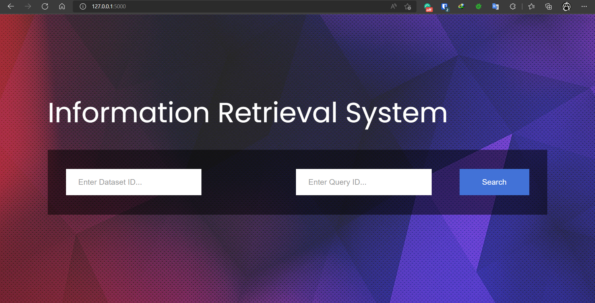
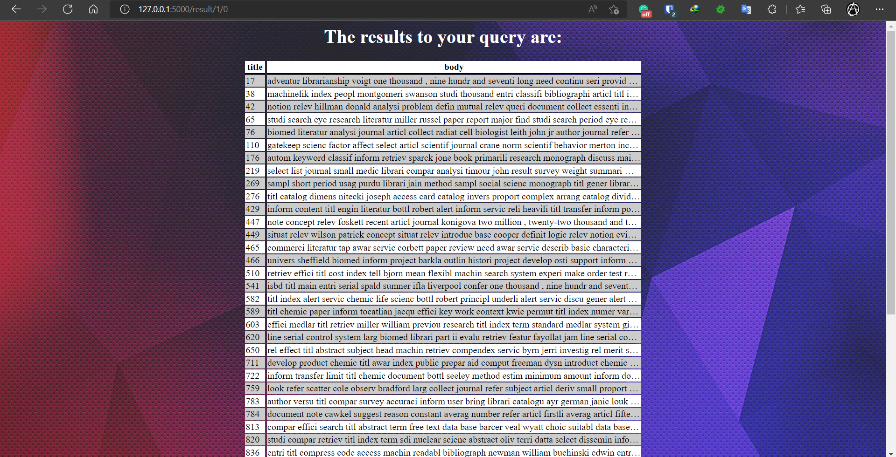

# Information Retrieval System

*Damascus University - Faculty of Information Technology Engineering*

Building an information retrieval system capable of adding documents in a specific field and the ability to query using natural language textually for information within these files.

## Main Screen:
<BR>


## Results Screen:
<BR>

## System Features
Building and implementing an information retrieval system that includes:
- Text processing of files The ability to root words using one of the well-known rooting algorithms.
- Text processing of files Ability to access irregular words (such as irregular verbs)
- Text processing of files that have different formats (such as dates)
- The ability to suggest a correction for words in the event that a query is entered in the wrong language
- The ability to access names in different ways of written representation.
- Building appropriate indexes for the content processed in the previous stages.
- Build a matching function between the query and the previous content.
- Search UI

## Advanced Features
- Use advanced word embedding models
- Topic detection
- Precision@10 precision – recall - precision - Mean Average Precision (MAP) - Mean Reciprocal Rank (MRR)


## Database characterization

Both databases used in the project contain a number of files (documents), which in turn contain a number of sections and must be processed.

**Databases used:**
- CACM.ALL
- CISI.ALL

First database: **CACM.ALL**

.I: The identifier for each file

.T: the title of each file

.A: the author of the file

.W: the content of each file

.X : References for each file


We processed and read this text so that we assumed that each file had a new identifier and content, so that the content was the combination of the title, author and content of the file so that we could access the important section of the file, which in our case is the content (content)

Second database: **CISI.ALL**

.I: The identifier for each file

.T: the title of each file

.B: file version date

.A: the author of the file

.N: The date the file was modified

.X : References associated with the file

We have processed this text in a similar way to the previous database, where we assumed that each file had a new identifier and content, so that the content was to collect the title, author and content of the file, so that we could access the important section of the file, which is the content in our case, and treat it in an optimal way.

### The First stage

The first stage of the project is based on the process of cleaning corpus data or the so-called pre-processing data, which is concerned with standardizing the form of the data that we will deal with later by removing the unimportant or most frequent words in the language called stop words and standardizing the form of some of the most frequent patterns in the files such as dates and rooting words
Before starting to apply the stages of cleaning files, we will read the datasets, which are:
- CACM.ALL
- CISI.ALL
We will convert them to tables to facilitate reading, dealing with and cleaning them, by taking advantage of the **pandas** library
To convert files from textual content to tables that can focus on one of its columns and manipulation
more effectively.
```javascript
cisi_text = ""
f1 = open('d:\\fifth\IR\IR\IR_Project_datasets-20220522T051310Z-001\IR_Project_datasets\CISI\cisi.txt', 'r')
for line in f1:
    cisi_text = cisi_text + line
cisi_corpus = cisi_text.split('\n')

cacm_text= ""
f2 = open('D:\\fifth\IR\IR\IR_Project_datasets-20220522T051310Z-001\IR_Project_datasets\cacm\cacm.txt', 'r')
for line in f2:
    cacm_text = cacm_text + line
cacm_corpus = cacm_text.split('\n')


cisi_dictionary = {
    '.I': [],
    '.C' : [],
    '.X' : []
}
cacm_dictionary = {
    '.I': [],
    '.C' : [],
    '.X' : []
}


def cisi_to_chunk(chunk):
    global person_names
    for sentence in chunk.split('\n'):
        if ".I" in sentence:
            start_index=chunk.find(".I")
            lword=len(".I")
            extracted_string= chunk[start_index:start_index+lword]
            required_string_index = chunk.index(extracted_string)+2
            required_string= chunk[required_string_index:chunk.find(".T")]
            cisi_dictionary[".I"].append(required_string)
        if ".T" in sentence:
            start_index=chunk.find(".T")
            lword=len(".T")
            extracted_string= chunk[start_index:start_index+lword]
            required_string_index = chunk.index(extracted_string)+2
            required_string= chunk[required_string_index:chunk.find(".X")]
            cisi_dictionary[".C"].append(required_string)
        if ".A" in sentence:
            start_index=chunk.find(".A")
            lword=len(".A")
            extracted_string= chunk[start_index:start_index+lword]
            required_string_index = chunk.index(extracted_string)+3
            required_string= chunk[required_string_index:chunk.find(".W")]
            person_names.append(required_string)
        if ".X" in sentence:
            start_index=chunk.find(".X")
            lword=len(".X")
            extracted_string= chunk[start_index:start_index+lword]
            required_string_index = chunk.index(extracted_string)+3
            required_string= chunk[required_string_index:chunk.find("\n.I")]
            cisi_dictionary[".X"].append(required_string)


isThereAnI = True
chunks_list = [None] * 1500
i = 0
for sentence in cisi_corpus:
    if ".I " in sentence:
        if isThereAnI:
            chunks_list[i]= ' '
            isThereAnI = False
        else:
            cisi_to_chunk(chunks_list[i])
            i = i + 1
            chunks_list[i] = ' '
    chunks_list[i] = chunks_list[i] + sentence + ' '


cisi_df = pd.DataFrame(data=cisi_dictionary)
# pd.set_option('max_columns', 5)
pd.set_option('max_colwidth', 10000)
cisi_df.columns = ['id','content','references']


def cacm_to_chunk(chunk):
    global person_names
    for sentence in chunk.split('\n'):
        if ".I" in sentence:
            start_index=chunk.find(".I")
            lword=len(".I")
            extracted_string= chunk[start_index:start_index+lword]
            required_string_index = chunk.index(extracted_string)+2
            required_string= chunk[required_string_index:chunk.find(".T")]
            cacm_dictionary[".I"].append(required_string)
        if ".T" in sentence:
            start_index=chunk.find(".T")
            lword=len(".T")
            extracted_string= chunk[start_index:start_index+lword]
            required_string_index = chunk.index(extracted_string)+2
            required_string= chunk[required_string_index:chunk.find(".N")]
            cacm_dictionary[".C"].append(required_string)
        if ".A" in sentence:
            start_index=chunk.find(".A")
            lword=len(".A")
            extracted_string= chunk[start_index:start_index+lword]
            required_string_index = chunk.index(extracted_string)+3
            required_string= chunk[required_string_index:chunk.find(".N")]
#             cacm_dictionary[".C"].append(required_string)
            person_names.append(required_string)
        if ".X" in sentence:
            start_index=chunk.find(".X")
            lword=len(".X")
            extracted_string= chunk[start_index:start_index+lword]
            required_string_index = chunk.index(extracted_string)+3
            required_string= chunk[required_string_index:chunk.find("\n.I")]
            cacm_dictionary[".X"].append(required_string)


isThereAnI = True
chunks_list = [None] * 3300
i = 0
for sentence in cacm_corpus:
    if ".I " in sentence:
        if isThereAnI:
            chunks_list[i]= ' '
            isThereAnI = False
        else:
            cacm_to_chunk(chunks_list[i])
            i = i + 1
            chunks_list[i] = ' '
    chunks_list[i] = chunks_list[i] + sentence + ' '


cacm_df = pd.DataFrame(data=cacm_dictionary)
pd.set_option('max_colwidth', 10000)
cacm_df.columns = ['id','content','references']
```

### The Second stage

Before we start executing requests, there is a certain sequence (chain of steps or pipe) that we will follow to make the best use of all requests and data cleaning algorithms:

To get to the roots of words, we can take advantage of the **nltk** library and the **lemmatize** model, which takes root the word, i.e. returns the word to its basic inflection and returns the plurals to the singular.

By taking advantage of **stemming** models, we were able to standardize the shape of some words, and this step was postponed until the end because it changes the shape of words and makes text revision processes ineffective as they should.

```javascript
#fifth cleaning round
#Apply lemmitization round of text cleaning techniques
#which is from parallel to singular
def clean_text_round5(text):
    new_text = ''
    lemma = nltk.wordnet.WordNetLemmatizer()
    words = word_tokenize(text)
    for w in words:
        w=lemma.lemmatize(w,pos='v')
        w = lemma.lemmatize(w)
        new_text += w + ' '
    return new_text
round5 = lambda x: clean_text_round5(x)


def clean_text_round6(text):
    new_text = ''
    words = word_tokenize(text)
    for w in words:
        if w.isnumeric():
            w = num2words(int(w))
        if(re.search(r'\d',w)):
            w = ' '
        new_text += w + ' '
    return new_text
round6 = lambda x: clean_text_round6(x)
```

### The Third stage

To access similar patterns such as dates, we can take advantage of the **date finder** library to find dates in various forms in the files, and because the algorithm on which the library is built, if it finds a date without a week or a month, it replaces it with the current day and month. To avoid this problem, we can dispense with the full date and replace it with the year.
```javascript
#forth cleaning round
#working on dates finding
def clean_text_round4(text):
    text = sent_tokenize(text)
    required_text = ""
    for sentence in text:
        matches = datefinder.find_dates(sentence,source = True)
        if matches is not None:
            try:
                for match in matches:
                    required_year = match[0].year
                    required_date =str(required_year)
                    temp_date = match[1]
                    sentence = sentence.replace(temp_date,required_date,1)
            except:
                print("error with date")
        required_text = required_text + sentence
    return required_text
round4 = lambda x: clean_text_round4(x)
```

### The Fourth stage

To correct words or misspellings in the query we make use of the **autocorrect** library where the function is:

We noticed that this library corrects the names in the query to other English words, which prompted us to exclude the names that we collected and stored in the ***person_names*** list in two stages:

1) The first phase: While reading the corpus we read the section on author name and add it to the list

2) The second phase: In the fifth request, it was requested to collect the names in the files and we added them to the same list
```javascript
#third cleaning round
#working on auto correct
def contain_in_names_list(name):
    found = False
    for person_name in person_names:
        if person_name.find(name) != -1:
            found = True
    return found

def clean_text_round3(text):
    new_text = ''
    words = word_tokenize(text)
    spell = Speller(lang='en')
    for w in words:
        if(not contain_in_names_list(w)):
            w = spell(w)
            new_text += w + ' '
        else:
            new_text += w + ' '
    return new_text
round3 = lambda x: clean_text_round3(x)
```

### The Fifth stage

To access human names, we made use of the **Human Name** library, but we applied this step as the first step of the data cleaning process, because the library works better if the names are written in the regular way (the name begins with a capital letter)

```javascript
# first round cleaning
# defining the names

person_list = []
persons = person_list
def clean_text_round1(text):
    global person_names
    tokens = nltk.tokenize.word_tokenize(text)
    pos = nltk.pos_tag(tokens)
    sentt = nltk.ne_chunk(pos, binary = False)
    person = []
    name = ""
    for subtree in sentt.subtrees(filter=lambda t: t.label() == 'PERSON'):
        for leaf in subtree.leaves():
            person.append(leaf[0])
        if len(person) > 1: #avoid grabbing lone surnames
            for part in person:
                name += part + ' '
            if name[:-1] not in person_list:
                person_list.append(name[:-1])
            name = ''
        person = []
    for person in person_list:
        person_split = person.split(" ")
        for name in person_split:
            if wordnet.synsets(name):
                if(name in person):
                    persons.remove(person)
                    break
    person_names = person_names + persons
#     print(person_names)
    return text
round1 = lambda x: clean_text_round1(x)
```

### Additional stage

In addition to the previous data cleaning steps, we have implemented some additional steps to standardize the data format:
This step represents the process of converting file texts to lowercase to standardize words consisting of the same order of letters with different representation, cleaning the texts from non-meaningful characters and removing the **stop words** provided by the **nltk** library in addition to the **common words** that were included with the datasets.

```javascript
#second cleaning round
#cleaning the additional \n and \t
#Apply a second round of text cleaning techniques
tokenizer = RegexpTokenizer(r'\w+')
stop_words = set(stopwords.words('english'))
commom_words = open('D:\\fifth\IR\IR\IR_Project_datasets-20220522T051310Z-001\IR_Project_datasets\cacm\common_words', 'r').read().split()

def clean_text_round2(text):
    new_text = ' '
    text = text.lower()
    text = re.sub('[''""_]',' ',text)
    text = re.sub('\t',' ',text)
    text = re.sub('\n',' ',text)
    text = re.sub('[%s]' % re.escape(string.punctuation), ' ',text)
    word_tokens = word_tokenize(text)
    for w in word_tokens:
#         print(w)
        if w not in commom_words and w not in stop_words:
            new_text = new_text + w +' '
    return new_text
round2 = lambda x: clean_text_round2(x)
```

We also made use of the **num2words** library to convert numbers into words, and the goal is to unify the vocabulary that represents the same number, whether it is a number or writing.

```javascript
def clean_text_round6(text):
    new_text = ''
    words = word_tokenize(text)
    for w in words:
        if w.isnumeric():
            w = num2words(int(w))
        if(re.search(r'\d',w)):
            w = ' '
        new_text += w + ' '
    return new_text
round6 = lambda x: clean_text_round6(x)
```

### Building an index

After we have implemented all the stages of cleaning and standardizing the data form, we can build the indexing **term-document index**, which is the index that links the unique indexing term to different files. 

We can also access this index by taking advantage of **sklearn** in two ways:

1) **CountVectorizer**: This model deduces the indexing term from the given files and for each file it counts the times the indexing term is repeated.

2) **TfidfVectorizer**: This model deduces the indexing term, but instead of counting it, it deduces the percentage of its existence and its relationship to the text by calculating the value of the **tfidf** through a mathematical equation.

Since the mathematical value that expresses the percentage of the indexing term in a particular text is more accurate than the number of times it is present in that text, we used the **TfidfVectorizer**

```javascript
cisi_df.content = cisi_df.content.apply(round1)
cisi_df.content = cisi_df.content.apply(round2)
# cisi_df.content = cisi_df.content.apply(round3)
cisi_df.content = cisi_df.content.apply(round4)
cisi_df.content = cisi_df.content.apply(round5)
cisi_df.content = cisi_df.content.apply(round6)
cisi_df.content = cisi_df.content.apply(round7)


vectorizer = TfidfVectorizer()
vectors = vectorizer.fit_transform(cisi_df.content)
columns = vectorizer.get_feature_names_out()
data_dtm_2 = pd.DataFrame(vectors.todense(),columns = columns)
pd.set_option('max_colwidth', 100)
pd.set_option('max_columns', 10000)


cacm_df.content = cacm_df.content.apply(round1)
cacm_df.content = cacm_df.content.apply(round2)
#cacm_df.content = cacm_df.content.apply(round3)
cacm_df.content = cacm_df.content.apply(round4)
cacm_df.content = cacm_df.content.apply(round5)
cacm_df.content = cacm_df.content.apply(round6)
cacm_df.content = cacm_df.content.apply(round7)

vectorizer = TfidfVectorizer()
cacm_vectors = vectorizer.fit_transform(cacm_df.content)
data_dtm_cacm = pd.DataFrame(cacm_vectors.todense(),columns = vectorizer.get_feature_names_out())
pd.set_option('max_colwidth', 100)
pd.set_option('max_columns', 10000)
```

### The Matching Function

After we carried out the stages of cleaning and standardizing the parameters of the 2 corpuses and deducing their respective indexes, we read the two queries, queries answers for each corpus, so that the final shape of the match function:

```javascript
def matching_function(corpus, queries, answers):
    output = {}
    vectorizer = TfidfVectorizer()
    train_set = corpus  # Documents
    test_set = queries
    new_test_set = []
    for test in test_set:
        test = clean_text_round1(test)
        test = clean_text_round2(test)
        test = clean_text_round3(test)
        test = clean_text_round5(test)
        test = clean_text_round6(test)
        test = clean_text_round7(test)
        new_test_set.append(test)

    trainVectorizerArray = vectorizer.fit_transform(train_set).toarray()
    testVectorizerArray = vectorizer.transform(new_test_set).toarray()

    i = 1;
    for testV in testVectorizerArray:
        d_cosines = []
        for vector in trainVectorizerArray:
            cosine = cx(vector, testV)
            d_cosines.append(cx(vector, testV))
        number = len(answers.get(i))
        out = np.array(d_cosines).argsort()[-number:][::-1]
        output[i] = out
        if (i < len(answers)):
            i = i + 1

    for out in output:
        output[out].sort()

    for out in output:
        i = 0
        for num in output[out]:
            output[out][i] = num + 1
            i = i + 1
    return output
```

To test the results of all queries in comparison to the queries_answer file, we used the concepts of ***precision***, ***recall*** provided by **sklearn** after building the calculate_measures function.

```javascript
def calculate_measures(true_answers, test_answers, document_size):
    accurecy_measures = {'true_answers': [], 'test_answers': [], 'precision': [], 'recall': []}
    counter = 1
    for true_answer, test_answer in zip(true_answers, test_answers):
        #         print(counter)
        accurecy_measures['true_answers'].append(counter)
        accurecy_measures['test_answers'].append(counter)
        arr_1 = [0] * document_size
        k = 0
        for i in arr_1:
            for j in true_answer:
                if k == j:
                    arr_1.insert(j, 1)
            k = k + 1
        arr_2 = [0] * document_size
        m = 0
        for i in arr_2:
            for j in test_answer:
                if m == j:
                    arr_2.insert(j, 1)
            m = m + 1

        precision = precision_score(arr_1, arr_2, average='macro', zero_division='warn')
        accurecy_measures['precision'].append(precision)

        recall = recall_score(arr_1, arr_2, average='weighted')
        accurecy_measures['recall'].append(recall)

        counter = counter + 1
    return accurecy_measures
```

Then we calculated the measures of accuracy (***precision***, ***recall***) for our method by taking advantage of the calculate measure, and we created a function for the ***Mean Reciprocal Rank***:

```javascript
def caculate_mrr(results,truths):
    MAX_RANK = 1000
    ranked_table = {'query_id':[],'document_id':[],'rank':[]} 
    answers_table = {'query_id':[],'document_id':[]}
    for row in results:
        temp_list = results[row]
        i = 1
        for num in temp_list:
            ranked_table['query_id'].append(row)
            ranked_table['document_id'].append(num)
            ranked_table['rank'].append(i)
            i = i+1
    ranked_df = pd.DataFrame(ranked_table)
    
    for row in truths:
        temp_list = truths[row]
        for num in temp_list:
            answers_table['query_id'].append(row)
            answers_table['document_id'].append(num)
    truths_df = pd.DataFrame(answers_table)

    hits = pd.merge(truths_df, ranked_df,
        on=["query_id", "document_id"],
        how="left").fillna(MAX_RANK)
    mrr = (1 / hits.groupby('query_id')['rank'].min()).mean()
    return mrr
```
# Advanced Features
## Topic Modelling
To find the topics covered in the database, we make use of the models provided by the **genism** library, but to begin with and to improve the results that will result from using this library, we will limit the processed content to words and sources (that is, similar topics are determined by sources because verbs do not express content) by dependent function extract_names_and_adjectives:

```javascript
def extract_names_and_adjectives(text):
    is_noun_or_adj = lambda pos: pos[:2] == 'NN' or pos[:2] == 'JJ'
    tokenized = word_tokenize(text)
    nouns_and_adjs = [word for(word,pos) in pos_tag(tokenized) if is_noun_or_adj(pos)]
    return ' '.join(nouns_and_adjs)
nouns_adjs= lambda x: extract_names_and_adjectives(x)

#Create Dictionary
cisi_df.content = cisi_df.content.apply(round2)
cisi_df.content = cisi_df.content.apply(round5)
cisi_df.content = cisi_df.content.apply(nouns_adjs)

arr = []
for sentence in cisi_df.content:
    arr.append(sentence)
dataset = [d.split() for d in arr]

id2word = corpora.Dictionary(dataset)
# print(id2word)

#create corpus
texts = dataset

# Term Document Frequency 
c = [id2word.doc2bow(text) for text in texts]  
```
After forming the new corpus we passed it to the **LDA model** provided by the **genism** library and determined the number of topics and the number of passes i.e. times to modify these topics to reach them in their best form.

The goal of this model is to infer mix of topics for each document and infer the mix of words for each topic.
```javascript
lda_model = gensim.models.ldamodel.LdaModel(corpus=c,
                                           id2word=id2word,
                                           num_topics=12, 
                                           random_state=100,
                                           update_every=1,
                                           chunksize=100,
                                           passes=30,
                                           alpha='auto',
                                           per_word_topics=True)

# Print the keyword of topics
pprint(lda_model.print_topics())
doc_lda = lda_model[c]
print(doc_lda)
```         
To measure the validity of the number of topics and the validity of the number of passes, we can use two measures:

- **Perplexity**: a scale whose value is in the range [0,-10] and the smaller this value, the better the number of topics

- **Coherence**: A scale whose value is in the domain [0,1] and the higher this value, the more humanly read the topics.

```javascript
# Compute Perplexity
print('\nPerplexity: ', lda_model.log_perplexity(c))  
# a measure of how good the model is. lower the better.

# Compute Coherence Score
coherence_model_lda = CoherenceModel(model=lda_model, texts=dataset, dictionary=id2word, coherence='c_v')
coherence_lda = coherence_model_lda.get_coherence()
print('\nCoherence Score: ', coherence_lda)

# Lower the perplexity better the model.
# Higher the topic coherence, the topic is more human interpretable.
```    
## Word Embedding
This technique is concerned with creating a new representation of the word so that the word and all its vocabulary have a similar mathematical representation, making similar texts have a close mathematical representation.

We implemented this technique via the **spacy**library and ***en_core_web_sm*** thesaurus download and to make this technique give the best possible results we have added some methods for cleaning queries, corpus :

```javascript
nlp = spacy.load("en_core_web_sm")
from nltk import pos_tag
def extract_names_and_adjectives(text):
    is_noun_or_adj = lambda pos: pos[:2] == 'NN' or pos[:2] == 'JJ'
    tokenized = word_tokenize(text)
    nouns_and_adjs = [word for(word,pos) in pos_tag(tokenized) if is_noun_or_adj(pos)]
    return ' '.join(nouns_and_adjs)
nouns_adjs= lambda x: extract_names_and_adjectives(x)

def delete_numbers(text):
    new_text = ''
    words = word_tokenize(text)
    for w in words:
        if w.isnumeric():
            w = ' '
        new_text += w + ' '   
    return new_text
del_numbers = lambda x: delete_numbers(x)
```  

We can pass through all queries and convert them to vector via the vector method:
```javascript
cisi_queries_list = []
cisi_queries_word_embedding_vectors = []

for test in cisi_queries:
    test = clean_text_round1(test)
    test = clean_text_round2(test)
    test = delete_dates(test)
    test = delete_numbers(test)
    test = clean_text_round5(test)
    test = clean_text_round7(test)
    test = extract_names_and_adjectives(test)
    cisi_queries_list.append(test)
print(len(cisi_queries_list))

for query in cisi_queries_list:
    cisi_queries_word_embedding_vectors.append(nlp(query).vector)

from sklearn.metrics.pairwise import cosine_similarity

documents = []
output = {}
i = 1;

for testV in cisi_queries_word_embedding_vectors:
    d_cosines = []
    try:
        for vector in cisi_corpus_word_embedding_vectors:
            cosine = cx(vector, testV)
            d_cosines.append(cx(vector, testV))
    except:
        number = len(cisi_answers_dictionary.get(i))
        d_cosines = [0] * number
        output[i] = d_cosines
        print("an error occured")
    number = len(cisi_answers_dictionary.get(i))
    out = np.array(d_cosines).argsort()[-number:][::-1]
    output[i] = out
    if(i < len(cisi_answers_dictionary)):
        i = i+1

for out in output:
    output[out].sort()

for out in output:
    i = 0
    for num in output[out]:
        output[out][i] = num+1
        i = i + 1

```  

## 🚀 Running the Project

- Install all the imported Libraries.
- Install Flask

```bash
  pip install [name-of-library]
```

- Run the Project via terminal
```bash
  cd UI
  Python Search.py
```

## References

 - [Gensim Documentation](https://radimrehurek.com/gensim/auto_examples/core/run_core_concepts.html#sphx-glr-auto-examples-core-run-core-concepts-py)
 - [Word Embedding In NLP with Python Code Implementation](https://www.analyticssteps.com/blogs/word-embedding-nlp-python-code)
 - [TF-IDF from scratch in python on a real-world dataset](https://towardsdatascience.com/tf-idf-for-document-ranking-from-scratch-in-python-on-real-world-dataset-796d339a4089)
 - [Information Retrieval using Boolean Query in Python](https://medium.com/voice-tech-podcast/information-retrieval-using-boolean-query-in-python-e0ea9bf57f76)


## Authors

- [@mahmoudAlmass](https://github.com/mahmoudAlmass)
- [@nooraldayoub](https://github.com/nooraldayoub)
- [@SamehaNsr](https://github.com/SamehaNsr)
- [@Ali-A-Ali](https://github.com/Ali-A-Ali)

